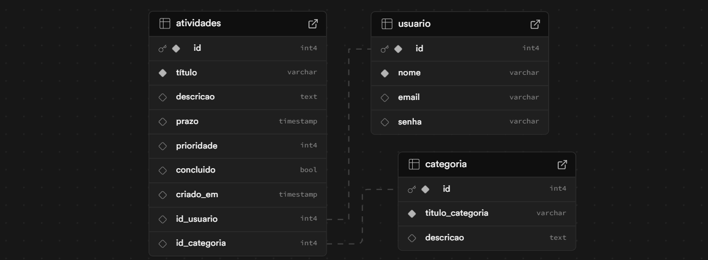
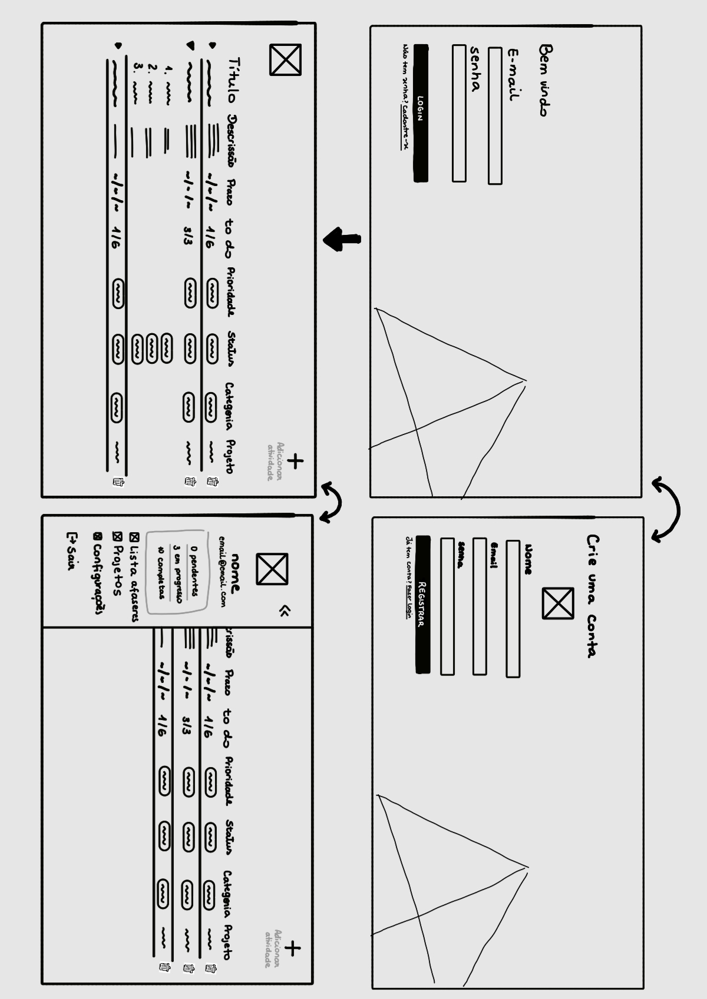
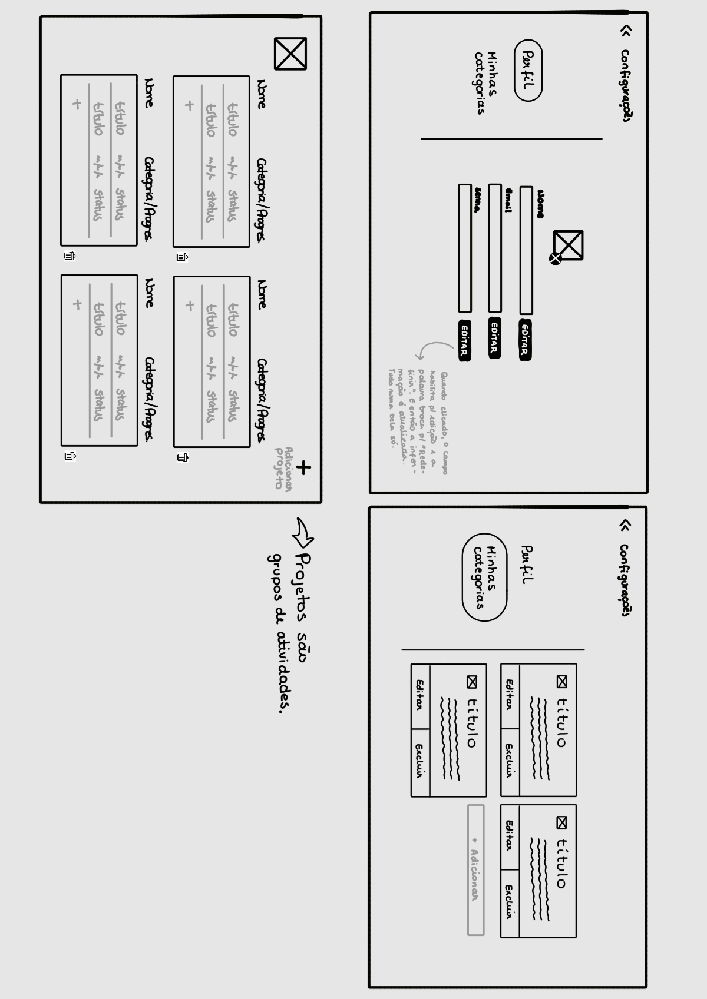

# Web Application Document - Projeto Individual - Módulo 2 - Inteli

## Sumário

1. [Introdução](#c1)  
2. [Visão Geral da Aplicação Web](#c2)  
3. [Projeto Técnico da Aplicação Web](#c3)  
4. [Desenvolvimento da Aplicação Web](#c4)  
5. [Referências](#c5)  

<br>

## <a name="c1"></a>1. Introdução (Semana 01)

Esse projeto tem como objetivo o desenvolvimento de uma **aplicação web para gerenciamento de atividades** para que os usuários tenham um maior controle de sua agenda, desde a organização ao acompanhamento do progresso dessas atividades diariamente, tendo como foco as ferramentas mais essenciais para tal. 

Para isso, a aplicação permite que os usuários criem uma conta, façam login e adicionem atividades com informações detalhadas, como título, descrição, prazo de conclusão, além de uma lista "to do" de sub-atividades relacionadas àquela principal. 

Tais atividades também podem ser categorizadas de acordo com as áreas da vida de cada usuário (como acadêmica, saúde e vida pessoal).  Ademais é possível organizar as atividades por grupos, ou seja, criar projetos. Isto proporciona uma visão clara e estruturada das responsabilidades.que o usuário tem.

Por fim, é possível realizar a edição e exclusão de atividades, garantindo flexibilidade e controle para que os usuários mantenham seu planejamento sempre atualizado.

---

## <a name="c2"></a>2. Visão Geral da Aplicação Web

### 2.1. Persona


### 2.2. User Stories


US01 | **Como** estudante, **quero** cadastrar atividades e adicionar informações **para que** eu não perca de vista prazos e detalhes importantes sobre elas.

US02 | **Como** estagiário no banco, **quero** categorizar minhas atividades por áreas da vida **para que** eu possa visualizar a distribuição do meu tempo e evitar que eu me sobrecarregue

US03 | **Como** freelancer, **quero** separar minhas atividades por projetos **para que** eu possa conclui-las no prazo e acompanhar seu progresso com mais eficiência

## Análise INVEST da User Story US01

**User Story analisada:**  
US01 | Como estudante, quero cadastrar atividades e adicionar informações para que eu não perca de vista prazos e detalhes importantes sobre elas.

- **I – Independente:** Pode ser desenvolvida e testada separadamente.

- **N – Negociável:** Todos os campos que contém os detalhes das atividades podem ser editados conforme a necessidade do usuário (ex.: mudar a tag de categoria e aumentar a descrição).

- **V – Valiosa:** Essa é a função mais básica e fundamental do sistema, sendo a base para o funcionamento de todas as outras funções (como criar projetos).

- **E – Estimável:** O esforço e tempo que precisam ser investidos no desenvolvimento dessa função são facilmente estimáveis.

- **S – Pequena:** Por consistir na determinação dos atributos da base de dados e em sua configuração, é uma funcionalidade viável de ser desenvolvida em pouco tempo.

- **T – Testável:** Sua validação é feita ao adicionar novas atividades na base de dados, podendo ser feita de forma rápida e simples.

---

## <a name="c3"></a>3. Projeto da Aplicação Web

### 3.1. Modelagem do banco de dados

**1. Introdução**

A plataforma foi desenvolvida utilizando cinco bancos de dados principais que armazenam as informações sobre os usuários, atividades, sub-atividades, projetos e as categorias. 

**2. Diagrama Lógico do Banco de Dados**



**3. Tabelas e Atributos**

**Usuário**
- `id`: Identificador único do usuário (PK)
- `nome`: Nome do usuário 
- `email`: email do usuário (único)

**Atividades**
- `id`: Identificador único (PK)
- `título`: nome da atividade
- `descricao`: detalhamento sobre a atividade
- `prazo`: data em que deve ser concluída
- `prioridade`: nível de importância em escala numérico
- `concluído`: Icheck-box que indica quando foi concluída
- `criado_em`: data de criação
- `usuario_id`: FK para usuarios
- `categoria_id`: FK para categoria` 

**Sub-atividades**
- `id`: Identificador único (PK)
- `título`: nome da atividade
- `descricao`: detalhamento sobre a atividade
- `prazo`: data em que deve ser concluída
- `prioridade`: nível de importância em escala numérico
- `concluído`: Icheck-box que indica quando foi concluída
- `criado_em`: data de criação
- `subatividade_id`: FK para atividades

**categorias**
- `id`: Identificador único do usuário (PK)
- `título_categoria`: nome da categoria
- `descricao`: detalhamento para entender o que ela inclui.

**projetos**
- `id`: Identificador único do usuário (PK)
- `titulo_projetos`: nome da categoria
- `descricao`: detalhamento para entender o que ela inclui.

**4. Cardinalidade das Relações**
 
- **Usuário → Atividades**: Um usuário pode ter várias atividades **1:N**. 
- **Projetos → Atividades**: Um projeto pode conter várias atividades **1:N**
- **Atividade → Subatividades**: Uma atividade pode conter várias sub-atividades **1:N**
- **Atividades → Categoria**: Uma atividade pode está relacionada a uma categoria **1:1**.

**5. Modelo Físico – Schema do Banco de Dados**

Abaixo está todas as instruções SQL utilizadas para a criação do banco de dados:

📄 **Arquivo .SQL com o schema:**  
```
-- criação da tabela de  usuário
CREATE TABLE IF NOT EXISTS usuario ( --user
  id SERIAL PRIMARY KEY,
  nome VARCHAR(50) NOT NULL,
  email VARCHAR(200),
  senha VARCHAR(200)
);

-- ciaração da tabela de categorias
CREATE TABLE IF NOT EXISTS categoria ( --category
  id SERIAL PRIMARY KEY,
  titulo_categoria VARCHAR(100) NOT NULL,
  descricao TEXT
);

-- ciaração da tabela de projetos
CREATE TABLE IF NOT EXISTS projetos ( --project
  id SERIAL PRIMARY KEY,
  titulo_projeto VARCHAR(100) NOT NULL,
  descrissao TEXT
);

-- criação da tabela de atividades
CREATE TABLE IF NOT EXISTS atividades ( --task
  id SERIAL PRIMARY KEY,
  título VARCHAR(50) NOT NULL,
  descricao TEXT,
  prazo TIMESTAMP,
  prioridade INTEGER,
  concluido BOOLEAN,
  criado_em TIMESTAMP,
  id_usuario INT,
  id_categoria INT,
  id_projeto INT,
  FOREIGN KEY (id_usuario) REFERENCES usuario(id),
  FOREIGN KEY (id_categoria) REFERENCES categoria(id),
  FOREIGN KEY (id_projeto) REFERENCES projetos(id)
);

-- criação da tabela de subAtividades
CREATE TABLE IF NOT EXISTS subAtividades ( --subtask
  id SERIAL PRIMARY KEY,
  titulo VARCHAR(50) NOT NULL,
  descricao TEXT,
  prazo TIMESTAMP,
  prioridade INTEGER,
  concluido BOOLEAN,
  criado_em TIMESTAMP,
  id_subAtividades INT,
  FOREIGN KEY (id_subAtividades) REFERENCES atividades(id)
);


```

### ✅ Instruções básicas para execução:

1. Abra o seu SGBD (ex: MySQL Workbench, pgAdmin, DBeaver).
2. Crie um banco de dados novo.
3. Execute o conteúdo do arquivo `.sql` para criar todas as tabelas com as relações corretamente definidas.

---

### 3.1.1 BD e Models (Semana 5)
Foi implementado 5 models (services) conforme a estrutura definida no banco de dados PostgreSQL.São eles:

1. **User Service**
   - Responsável pelo gerenciamento de usuários.
   - Atributos: id, name, email e senha.
   - Métodos principais:
     - `getAllUsers`: Busca todos os usuários
     - `getUserById`: busca usuário por ID
     - `createUser`: Cria novo usuário
     - `updateUser`: Atualiza dados do usuário
     - `deleteUser`: Remove usuário do sistema

2. **Category Service**
   - Responsável pelo gerenciamento de categorias.
   - Atributos: id, título e descrição.
   - Métodos principais:
     - `getAllCategory`: Busca todas as categorias
     - `getCategoryById`: busca categoria por ID
     - `createCategory`: Cria novo categoria
     - `updateCategory`: Atualiza dados da categoria
     - `deleteCategory`: Remove categoria do sistema

3. **Project Service**
   - Responsável pelo gerenciamento de projetos
   - Atributos: id, título e descrição
   - Métodos principais:
     - `getAllProject`: Busca todas os projetos
     - `getProjectById`: busca projeto por ID
     - `createProject`: Cria novo projeto
     - `updateProject`: Atualiza dados do projeto
     - `deleteProject`: Remove projeto do sistema

4. **Task Service**
   - Responsável pelo gerenciamento de atividades
   - Atributos: id, título, descrição, prazo, prioridade, concluido, criado_em, id_usuário, id_categoria, id_projeto.
   - Métodos principais:
     - `getAllTask`: Busca todas as atividades
     - `getTaskById`: busca atividade por ID
     - `createTask`: Cria nova atividade
     - `updateTask`: Atualiza dados da atividade
     - `deleteTask`: Remove atividade do sistema

5. **Subtask Service**
   - Responsável pelo gerenciamento de sub-atividades
   - Atributos: id, título, descrição, prazo, prioridade, concluído, criado_em, id_subAtividades.
   - Métodos principais:
     - `getAllSubtask`: Busca todas as sub-atividades
     - `getSubtaskById`: busca sub-atividades por ID
     - `createSubtask`: Cria nova sub-atividades
     - `updateSubtask`: Atualiza dados da ativsub-atividadesidade
     - `deleteSubtask`: Remove sub-atividades do sistema

### 3.2. Arquitetura (Semana 5)

Para essa aplicação, a arquitetura MVC foi implementada da seguinte maneira:


**Fluxo de dados**

 O **model** é responsável pela lógica de negócios e interação com o banco de dados via Supabase. Ao se comunicar com o servidor do banco de dados (PostgreeSQL), o model é capaz de realizar as operações solicitadas pelo controller. No que se refere ao **controller**, ele é a camada intermediária entre model e view, sendo responsável por receber as requisições HTTP, processa-las de acordo com as funções disponíveis e chamar o model correspondente para acessar os dados no banco. Com isso, é possível que haja atualizações tanto no model quanto nos controllers. Além disso, é essencial para configuração das rotas. Já a **view** estabelece a interface do usuário na aplicação e é responsável por enviar as requisições HTTP para o controller como por exemplo: "`GET/users`" e "`PUT/users/:id`"

### 3.3. Wireframes (Semana 03)





*[`Clique aqui`](https://drive.google.com/drive/folders/1j3kOzpE68LY-0CXom_HhnzpNouGrxQz3?usp=sharing)  para acessar as imagens no drive*

Para o wireframe, foi esboçado as telas e funcionalidades que compõem a base principal da aplicação junto com algumas anotações.

Nesse sentido, estão representadas (da esquerda para a direita e de cima para baixo) as telas de: (1) Log-in; (2) Cadastro; (3) Tela de atividades; (4) Tela de menu expandida; (5) Configuração-perfil; (5) Configuração-categorias; e, por fim,  (6) Tela de projetos. 

As telas de Log-in e cadastro são simples e contam com campos para serem preenchidos com as informações de login do usuário. Elas também possuem atalhos umas para as outras, encontrado na frase que se encontra abaixo dos botões.

A terceira tela contém uma lista de todas as atividades cadastradas pelo usuário e o detalhamento de cada uma, sendo elas: título, descrição, prazo, “to do”, prioridade, status, categoria e projeto a que pertence. Somado a isso, as opções de excluir e adicionar estão indicadas por ícones e, para editar, basta clicar no campo referente. A quarta tela por sua vez, conta com atalhos para outras telas e um resumo geral acerca do status das atividades. Ambas as telas se relacionam, portanto, com a primeira user story pois garantem uma visualização eficiente das informações e manipulação simples delas.

Por outro lado, enquanto a tela de configurações-perfil permite a edição de informações pessoais de Log-in, a de configurações-Categorias permite que sejam criadas e editadas tags que servem como organizadores das atividades, podendo ser definidas de forma individual pelo usuário. Por conta disso, esta tela em específico se relaciona com a segunda user story.

Por fim, a tela de projetos conta com uma série de cards expansíveis, esses cards são agrupamento de atividades feitos para que o usuário se organize por projeto e acompanhe seu progresso neles. Por exemplo, se o usuário tem uma aplicação web para desenvolver no seu trabalho, ele pode criar um projeto que agrupará todas as atividades relacionadas. Dessa forma, essa tela se relaciona com a terceira user story.

### 3.4. Guia de estilos (Semana 05)

*Descreva aqui orientações gerais para o leitor sobre como utilizar os componentes do guia de estilos de sua solução.*


### 3.5. Protótipo de alta fidelidade (Semana 05)

*Posicione aqui algumas imagens demonstrativas de seu protótipo de alta fidelidade e o link para acesso ao protótipo completo (mantenha o link sempre público para visualização).*

### 3.6. WebAPI e endpoints (Semana 05)

 #### Usuario

| Método | Endpoint        | Descrição                  | Parâmetros / Corpo                                                                                                             |
| ------ | --------------- | -------------------------- | ------------------------------------------------------------------------------------------------------------------------------ |
| POST   | `/user`     | Criar um novo usuário      | Corpo JSON: `{ id, nome, email, senha }`                                                  |
| GET    | `/user`     | Listar todos os usuários   | -                                                                                                                              |
| GET    | `/user/:id` | Buscar usuário pelo ID     | Parâmetro URL: `id` (ID do usuário)                                                                                            |
| PUT    | `/user/:id` | Atualizar dados do usuário identificando-o pelo ID | Parâmetro URL: `id` <br> Corpo JSON: campos a atualizar, ex: `{ nome, email, senha }` |
| DELETE | `/user/:id` | Deletar usuário pelo ID    | Parâmetro URL: `id`                                                                                                            |

 #### categoria

| Método | Endpoint        | Descrição                  | Parâmetros / Corpo                                                                                                             |
| ------ | --------------- | -------------------------- | ------------------------------------------------------------------------------------------------------------------------------ |
| POST   | `/category`     | Criar uma nova categoria      | Corpo JSON: `{ id, título_categoria, descricao }`                                                  |
| GET    | `/category`     | Listar todas as categorias   | -                                                                                                                              |
| GET    | `/category/:id` | Buscar categoria pelo ID     | Parâmetro URL: `id` (ID do usuário)                                                                                            |
| PUT    | `/category/:id` | Atualizar dados da categoria | Parâmetro URL: `id` <br> Corpo JSON: campos a atualizar, ex: `{ título_categoria, descricao }` |
| DELETE | `/category/:id` | Deletar categoria pelo ID    | Parâmetro URL: `id`  

 #### projeto

| Método | Endpoint        | Descrição                  | Parâmetros / Corpo                                                                                                             |
| ------ | --------------- | -------------------------- | ------------------------------------------------------------------------------------------------------------------------------ |
| POST   | `/project`     | Criar um novo projeto      | Corpo JSON: `{ id, titulo_projeto, descricao }`                                                  |
| GET    | `/project`     | Listar todos os projetos   | -                                                                                                                              |
| GET    | `/project/:id` | Buscar projeto pelo ID     | Parâmetro URL: `id` (ID do usuário)                                                                                            |
| PUT    | `/project/:id` | Atualizar projeto do usuário | Parâmetro URL: `id` <br> Corpo JSON: campos a atualizar, ex: `{ titulo_projeto, descricao }` |
| DELETE | `/project/:id` | Deletar projeo pelo ID    | Parâmetro URL: `id`  

 #### Atividades

| Método | Endpoint        | Descrição                  | Parâmetros / Corpo                                                                                                             |
| ------ | --------------- | -------------------------- | ------------------------------------------------------------------------------------------------------------------------------ |
| POST   | `/task`     | Criar uma nova atividade      | Corpo JSON: `{ id, título, descricao, prazo, prioridade, concluido, criado_em, id_usuario, id_categoria, id_projeto }`                                                  |
| GET    | `/task`     | Listar todas as atividades   | -                                                                                                                              |
| GET    | `/task/:id` | Buscar atividade pelo ID     | Parâmetro URL: `id` (ID do usuário)                                                                                            |
| PUT    | `/task/:id` | Atualizar dados das atividades | Parâmetro URL: `id` <br> Corpo JSON: campos a atualizar, ex: `{ título, descricao, prazo, prioridade, concluido, criado_em, id_usuario, id_categoria, id_projeto}` |
| DELETE | `/task/:id` | Deletar atividade pelo ID    | Parâmetro URL: `id`  

 #### sub-atividades

| Método | Endpoint        | Descrição                  | Parâmetros / Corpo                                                                                                             |
| ------ | --------------- | -------------------------- | ------------------------------------------------------------------------------------------------------------------------------ |
| POST   | `/subtask`     | Criar uma nova sub-atividade      | Corpo JSON: `{ id, titulo, descricao, prazo, prioridade, concluido, criado_em, id_subAtividades }`                                                  |
| GET    | `/subtask`     | Listar todas as sub-atividades   | -                                                                                                                              |
| GET    | `/subtask/:id` | Buscar sub-atividade pelo ID     | Parâmetro URL: `id` (ID do usuário)                                                                                            |
| PUT    | `/subtask/:id` | Atualizar dados das sub-atividades | Parâmetro URL: `id` <br> Corpo JSON: campos a atualizar, ex: `{ id, titulo, descricao, prazo, prioridade, concluido, criado_em, id_subAtividades}` |
| DELETE | `/subtask/:id` | Deletar sub-atividade pelo ID    | Parâmetro URL: `id`  

### 3.7 Interface e Navegação (Semana 07)

*Descreva e ilustre aqui o desenvolvimento do frontend do sistema web, explicando brevemente o que foi entregue em termos de código e sistema. Utilize prints de tela para ilustrar.*

---

## <a name="c4"></a>4. Desenvolvimento da Aplicação Web (Semana 8)

### 4.1 Demonstração do Sistema Web (Semana 8)

*VIDEO: Insira o link do vídeo demonstrativo nesta seção*
*Descreva e ilustre aqui o desenvolvimento do sistema web completo, explicando brevemente o que foi entregue em termos de código e sistema. Utilize prints de tela para ilustrar.*

### 4.2 Conclusões e Trabalhos Futuros (Semana 8)

*Indique pontos fortes e pontos a melhorar de maneira geral.*
*Relacione também quaisquer outras ideias que você tenha para melhorias futuras.*


## <a name="c5"></a>5. Referências

_Incluir as principais referências de seu projeto, para que seu parceiro possa consultar caso ele se interessar em aprofundar. Um exemplo de referência de livro e de site:_<br>

---
---