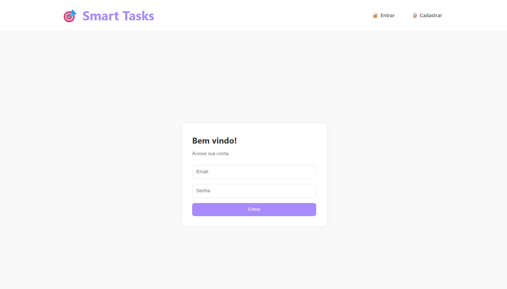
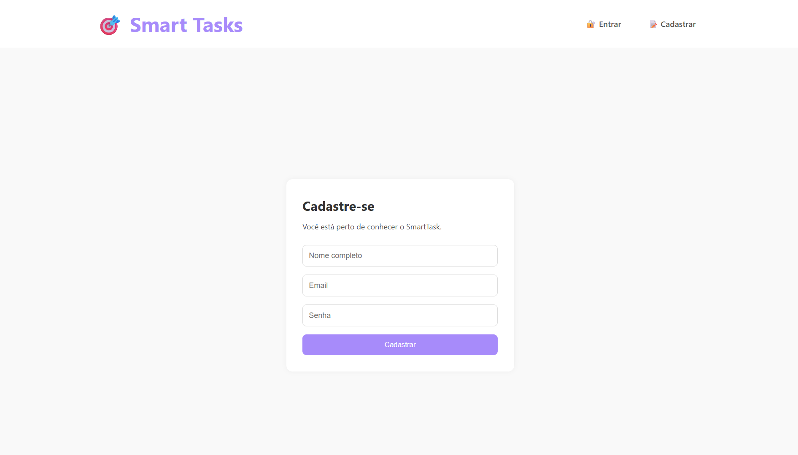
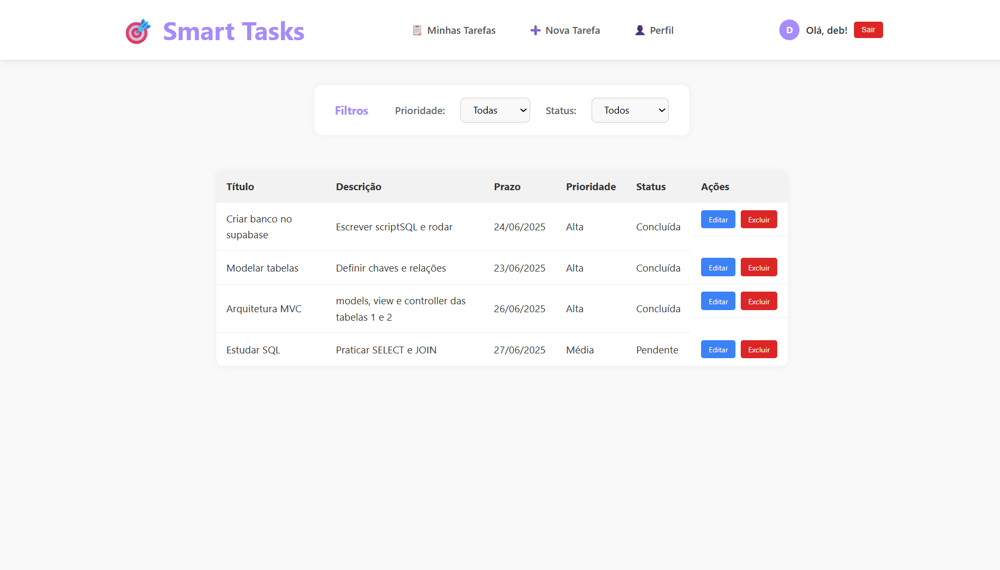
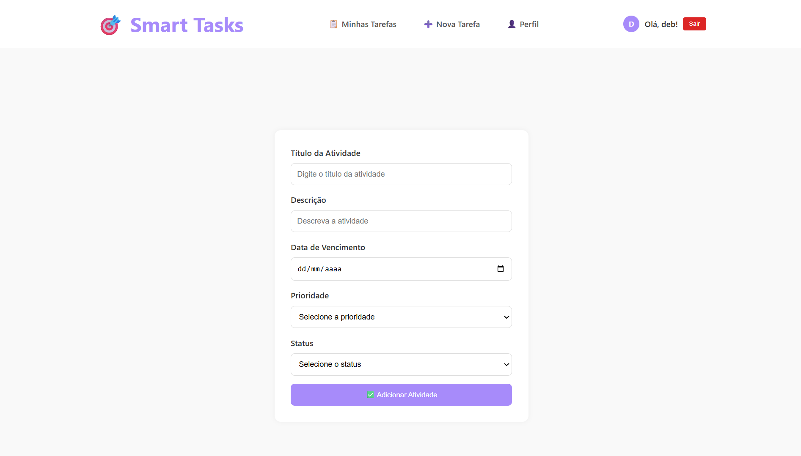
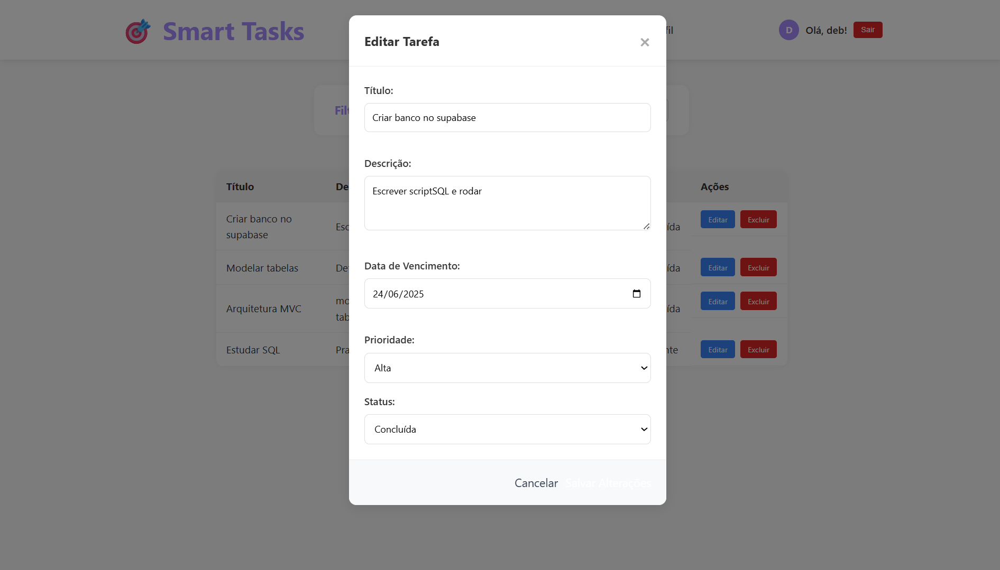
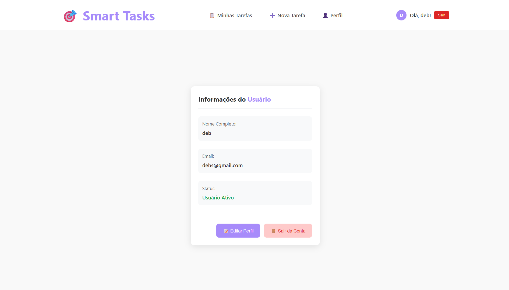

# Descrição do projeto
O SmartTasks é um sistema web desenvolvido para gerenciar atividades de forma prática e organizada. Após o login, o usuário é direcionado para a tela principal e poderá ver sua lista completa de afazeres bem como adicionar novas atividades, edita-las ou remove-las. Ao criar atividades é possível adicionar informações detalhadas, incluindo título, descrição e data de conclusão esperada.

## Tecnologias Utilizadas

| Este projeto é um boilerplate básico para uma aplicação Node.js seguindo o padrão MVC (Model-View-Controller), utilizando PostgreSQL como banco de dados.

### Backend
- Node.js: Runtime JavaScript
- Express.js: Framework web
- PostgreSQL: Banco de dados relacional
- EJS: Template engine
- Express Session: Gerenciamento de sessões
### Frontend
- HTML5: Estrutura das páginas
- CSS3: Estilização customizada

## Estrutura de Pastas (MVC)
```
projeto-eventos/
│
├── config/ # Configuração do banco de dados
│ └── database.js
├── controllers/ # Lógica de controle de dados
│ └── eventoController.js
├── models/ # Modelos do banco (query builders)
│ └── Evento.js
├── routes/ # Rotas da aplicação
│ └── index.js
├── views/ # Páginas renderizadas com EJS
│ └── pages/
│ ├── home.ejs
│ └── eventos.ejs
├── public/ # Arquivos estáticos (CSS, JS, imagens)
│ ├── css/
│ │ └── style.css
│ └── js/
│ └── script.js
├── .env # Variáveis de ambiente 
├── .gitignore
├── package.json
├── server.js # Ponto de entrada da aplicação
└── README.md
```

---

## Como executar o projeto localmente  

**0. Pré-requisitos**
- Node.js (versão 14 ou superior)
- PostgreSQL (versão 12 ou superior)
- NPM 

**1. Escolha uma IDE (ex.:VS Code)**  

**2. Clone o repositório para a sua máquina**  

```bash
git clone https://github.com/deborangueira/M2-Projeto_Pessoal
cd M2-Projeto_Pessoal
```

**3. No terminal, instale as dependências:**
```bash
npm install 
```

**4. Configure o arquivo `.env`:**  
Renomeie o arquivo .env.example para .env e configure as variáveis de ambiente necessárias, como as configurações do banco de dados PostgreSQL. Para isso, no supabase, acesse o painel do seu projeto e em "connect", no menu superior, busque por "Session pooler" e expanda o menu de "View parameters". Assim você acessa as informações que devem ser colocadas nesse arquivo.

```bash
# Configurações do Banco de Dados
DB_HOST=localhost
DB_PORT=5432
DB_DATABASE=nome_do_banco
DB_USER=seu_usuario_postgres
DB_PASSWORD=sua_senha
DB_SSL=false

# Configurações do Servidor
PORT=3000
```

**5. No terminal, inicialize o banco de dados:**
```bash
# Comando para executar o scriptSQL e criar as tabelas
npm run init-db
```

**6. Ainda no terminal, inicie o servidor com:**  
```bash
# Durante o desenvolvimento (com nodemon)
npm run dev

# Produção
npm start
```
**7. Acesse a aplicação:**  
No navegador, coloque: http://localhost:3000  

## Funcionalidades  

### Gerenciamento de usuários
- Cadastro e autenticação de usuários
- Armazenamento de dados da sessão de forma segura com o express-session.

### Gestão de atividades
- Adição, edição e exclusão de atividades
- Categorização e filtro com base em prioridade e status

Acesse a documentação técnica completa em: [Web Application Document (WAD)](https://github.com/deborangueira/M2-Projeto_Pessoal/blob/main/documentos/wad.md) 

## Banco de dados  
### Atributos das tabelas  

**Usuário**
- id, nome, email, senha
  
**Atividades**  
  - id, título, descrição, prazo, prioridade, concluido, criado_em, id_usuario


## Vídeo de demonstração
[Assista aqui ao vídeo de demonstração)](https://github.com/deborangueira/M2-Projeto_Pessoal/blob/main/documentos/wad.md) 

## Interface

### Páginas de login e cadastro




### Lista de atividades



### Criar nova atividade


### Aditar atividade


### Perfil


## Arquitetura MVC utilizada
- Model `(models/)`: Lógica de negócios e acesso a dados
- View `(views/)`: Interface do usuário (EJS + CSS + JS)
- Controller `(controllers/)`: Lógica de aplicação e rotas

## Autoria
Desenvolvido por [Débora Pereira Nogueira](https://www.linkedin.com/in/debora-pereira-nogueira/).

## Licença
Este projeto está licenciado sob a Licença MIT.  

Este README.md fornece uma visão geral clara do boilerplate, incluindo instruções de instalação, configuração do banco de dados, funcionalidades principais, scripts disponíveis, estrutura de diretórios, como contribuir e informações de licença. Certifique-se de personalizar as seções com detalhes específicos do seu projeto conforme necessário.
